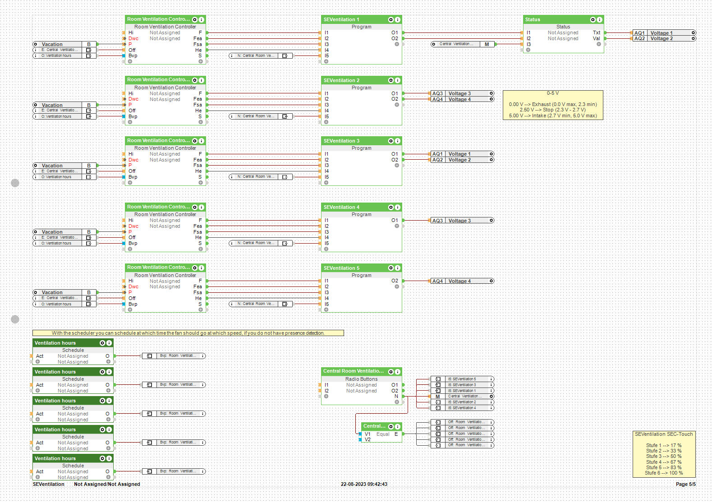

# Loxone - SEVentilation

<small>GitHub repository: [mr-manuel/Loxone/tree/master/SEVentilation](https://github.com/mr-manuel/Loxone/tree/master/SEVentilation)</small>

## Disclaimer

I wrote this script for myself. I'm not responsible, if you damage something using my script.

## Supporting/Sponsoring this project

You like the project and you want to support me?

## Purpose

This PicoC code connects a `Room Ventilation Controller` function block to an analog output for fans with an intake/exhaust ability. This allows to control a SEVentilation fan pair directly. It can also be used for other fans that are controlled by a 0-5 V or 0-10 V signal, where the lowest voltage is one direction, the mean voltage is stop and the highes voltage the other direction.

## How to use

1. Insert a `Room Ventilation Controller` function block
2. Insert a `Program` function block and copy the content from [`SEVentilation.c`](./SEVentilation.c) into the `Program` function block
3. Connect function blocks and analog output

   ### Inputs

   - **I1:** connect F (Fan) from Room Ventilation Controller - fan speed 0 - 100 %
   - **I2:** connect Fea (Fan exhaust air) from Room Ventilation Controller - fan speed exhaust 0 - 10ö %
   - **I3:** connect Fsa (Fan supply air) from Room Ventilation Controller - fan speed supply 0 - 100 %
   - **I4:** connect He (Heat exchanger) from Room Ventilation Controller - heat exchange 0 = off; 1 = on
   - **I5:** 
     0 = normal operation 
     1 = O1 exhaust only, O2 supply only 
     2 = O1 supply only, O2 exhaust only

   ### Outputs

   - **O1:** connect first (third, fith, ...) ventilation from a pair to an analog 0-10 V output (only 0-5 V are used; make sure to limit to max. 5 V)
   - **O2:** connect second (fourth, sixth, ...) ventilation from a pair to an analog 0-10 V output (only 0-5 V are used; make sure to limit to max. 5 V)

## Screenshots

Loxone Config

## Sample file

You can also download the [Loxone Config example file](./SEVentilation.Loxone) from the screenshot above.
